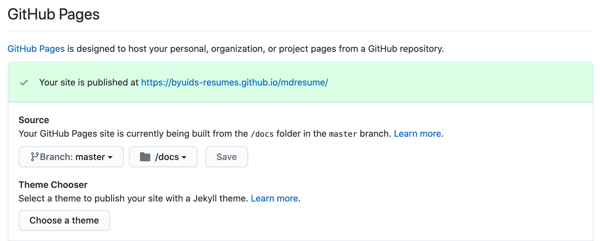

# md-resume

A resume maintained in plain text and rendered to HTML and PDF using CSS.

For more details, see the [markdown-csv project page](http://elipapa.github.io/markdown-cv), or the blog post on [why I switched to markdown for my CV](http://elipapa.github.io/blog/why-i-switched-to-markdown-for-my-cv.html).

https://larsojor1.github.io/larson_resume/

***

## Customization

Simply [fork the mdresume repo](https://github.com/byuids-resumes/mdresume)

and edit the `index.md` file in the `docs` folder [directly in Github](https://help.github.com/articles/editing-files-in-your-repository/)

adding your skills, jobs and education.

## Distribution

To transform your plain text resume into a beautiful and shareable HTML page, you have two options:

### I. Use Github Pages to publish it online

1. Edit or move your resume to the `index.md` file in the `docs` folder.
2. Go to settings > GitHub pages to make the changes shown.

3. Head to larsojor1.github.io/mdresume to see your resume live.

Any change you want to make to your CV from then on would have to be done in the `docs` folder and will be immediately rendered by Github Pages.

## Resume

Jordan Larson

EDUCATION
Brigham Young University Idaho, Rexburg, Idaho
Bachelor’s in General Psychology 2018 - 2022
 
SKILLS
•	Proficient in R coding, SPSS, and Jasp
  o	 Comfortable with data wrangling and complex visualization techniques (ggplot, base R)
  o	Comfortable with statistical testing and interpretation
•	Experience in data wrangling/visualization techniques in Python (pandas/altair)
•	Capable in intermediate MySQL queries and data manipulation
•	Proficient in predictive regression modelling
•	Proficient in ANOVA testing (one-way, two-way, complete blocking, split plot, ANCOVA)
•	3 Months of research with a professor in a PhD program
•	1.5 years of research doing health assessments, data collection, and analysis via Qualtrics Surveys
•	Microsoft Office/Excel (And Google equivalents)
•	Fluent in Spanish

WORK EXPERIENCE
KYANI INC., Rexburg, Idaho
Customer Service Rep, Quality Assurance Representative, Team Lead, Fraud and Disputes – March 2019 – Present
•	Worked phone queues for inbound calls (Spanish and English) in customer service
•	Moved to Quality Assurance with new responsibilities of listening to representative calls and scoring them
•	Developed data trackers and reporting sheets for the QA program
•	Lead a team of  ~20 Customer Service reps, including training new reps
•	Supervised the Kyani Fraud Prevention and Chargeback/Disputes departments in addition to Quality Assurance

BRIGHAM YOUNG UNIVERSITY-IDAHO LEAD RESEARCH ASSISTANT, Rexburg, Idaho
Health Psychology Department Lead Research Assistant – January 2020 – March 2021
•	Worked closely with a college professor to design experiments relating to covid-19
•	Delegated responsibilities to a team of 7 other RA’s

BRIGHAM YOUNG UNIVERSITY-IDAHO TUTOR, Rexburg, Idaho
Behavioral Neurobiology, Health Psychology, Sensation and Perception – January 2020 – November 2020
•	Prepared students for exams, answered questions
•	Customized individualized study plans for students
•	Created practice quizzes and exams based on course material
Data Science Lab Tutor – January 2022-April 2022
•	Taught and answered questions pertaining to R coding to students in an open-lab format

DESERET INDUSTRIES, Rexburg, Idaho
Lead Associate, April 2018 – January 2019
•	Direct the work of associates in the organization, pricing, and merchandising of products
•	Price rare or unique “collectible” items 
•	Supervise (as a team lead) associates with mental disabilities, diverse ethnic background, and different languages

### Author

Eliseo Papa ([Twitter](http://twitter.com/elipapa)/[Github](http://github.com/elipapa)/[Website](https://elipapa.github.io)).

### License

[MIT License](https://github.com/elipapa/markdown-cv/blob/master/LICENSE)
